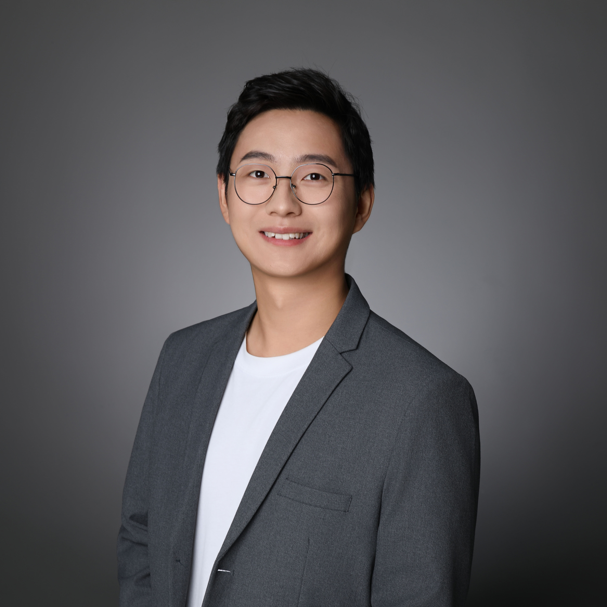

# About Me

Here is **Heng Cao (操亨)**.

My research interests foucs on the reaction mechanism investigation of  **photocatalytic oxidative coupling of methane (OCM)** and **CO2 photoreduction (CO2RR)** by advanced techniques like *in situ* XAFS and SFGS. Currently, I am working as an associate research fellow in the **National Synchrontron Radiation Lab** (NSRL) at University of Science and Technology of China, cooperate with [Prof. Jun Bao](http://team.ustc.edu.cn/Baogroup/zh_CN/).

 

## Academic Background

- **Sep 2014 - June 2018:** China University of Geoscience (Major in Applied Chemistry, Bachelor)
- **Sep 2018 - June 2023:** University of Science and Technology of China (Major in Nuclear Science and Technology, PhD)

 

---

## Research Interests

- CO2 photoreduction/CH4 photooxidation reaction mechanism investigation
- Synchrontron Radiation/Free Electron Laser based Charaterizations

My current research focuses on the **reaction mechanism investigation** of **CO2 photoreduction** or **CH4 photooxidation** via advanced charaterizations, especially Synchrontron Radiation based (sXAS, XAFS, SRPES, DRIFTS, SVUV-PIMS) and Free Electron Laser based (SFG, nano-IR) techonologies.  

---

## News and Updates
