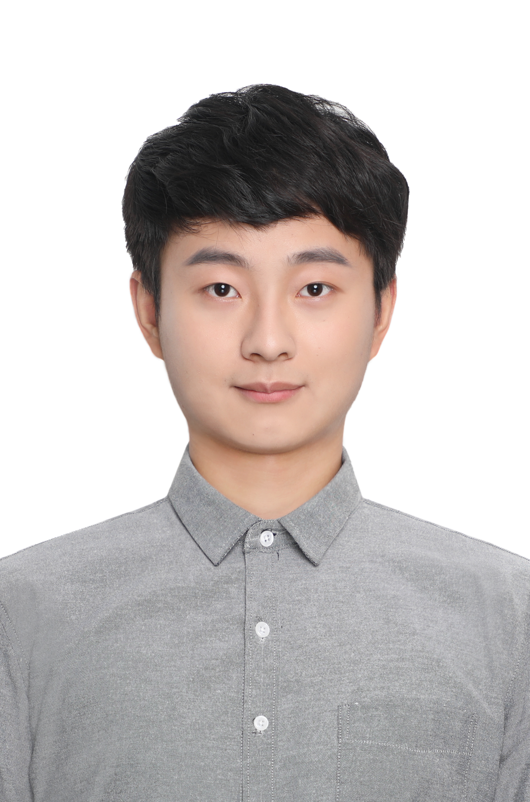

# About Me

Here is **Heng Cao (操亨)**.

I am a postdoctoral fellow majoring in **CO2 photoreduction** at University of Science and Technology of China. Currently, I am working as a postdoctor in the **National Synchrontron Radiation Lab** (NSRL), advised by [Prof. Jun Bao](http://team.ustc.edu.cn/Baogroup/zh_CN/) and cooperate with [Prof. Yang Pan](https://www.x-mol.com/groups/Pan_Yang).

 

## Academic Background

- **Sep 2014 - June 2018:** China University of Geoscience (Major in Applied Chemistry, Bachelor)
- **Sep 2018 - May 2023:** University of Science and Technology of China (Major in Nuclear Science and Technology, PhD)

 

---

## Research Interests

- Active sites modulation
- CO2 photoreduction CH4 photooxidation
- Synchrontron Radiation based Charaterizations

My current research focuses on the **mechanism of how active sites work** in the reaction of **CO2 photoreduction** or **CH4 photooxidation** via advanced charaterizations, especially Synchrontron Radiation based (XAS, SEPES, DRIFTS, SVUV-PIMS) and Free Electron Laser based (SFG, nano-IR) techonologies.  

---

## News and Updates
