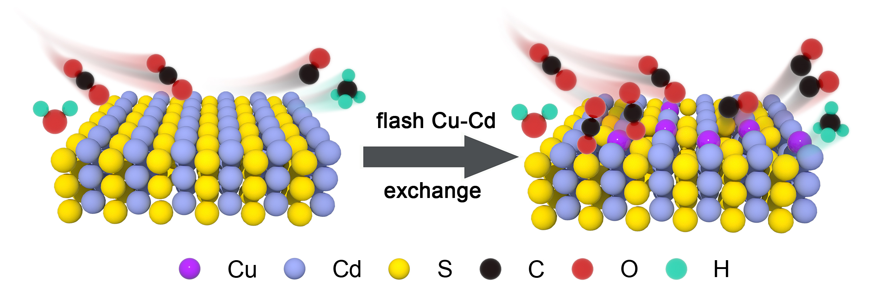
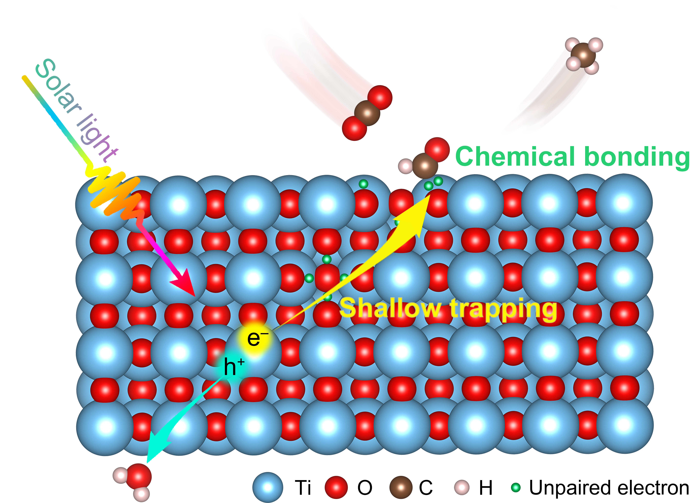

Lastest Update: 11st Sep 2023&nbsp; 

## Peer-reviewed Papers

- [Construction of atomically dispersed Cu sites and S vacancies on CdS for enhanced photocatalytic CO2 reduction](https://pubs.rsc.org/en/content/articlelanding/2021/TA/D1TA03615G#!divAbstract) **Heng Cao**, Jiawei Xue, Zhiyu Wang, Jingjing Dong, Wenjie Li, Ruyang Wang, Song Sun, Chen Gao, Yisheng Tan, Xiaodi Zhu, Jun Bao  <i>J. Mater. Chem. A</i>, <b>2021</b>, 9(30): 16339-16344. 

- [Unpaired electron engineering enables efficient and selective photocatalytic CO2 Reduction to CH4.](https://pubs.acs.org/doi/full/10.1021/acs.jpclett.2c01983) **Heng Cao**, Shenlong Jiang, Jiawei Xue, Xiaodi Zhu, Qun Zhang, and Jun Bao. <i>J. Phys. Chem. Lett.</i>, <b>2022</b>, 13(36): 8397-8402. 

## Contributed Papers

